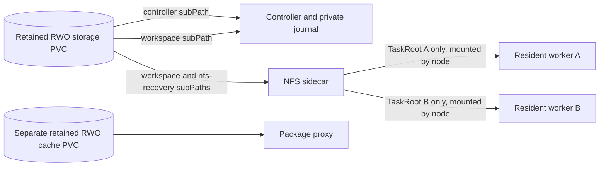

# Multica Runtime Controller

This chart runs one controller, an NFS-Ganesha sidecar, and an optional package proxy in a `Recreate` Deployment. The complete runtime image supplies the controller, installed providers, development tools, and prepared Chrome profile. Workers use the controller's observed image digest.

Follow-up turns can retain the same admitted worker Pod, checkout, desktop, and original Chrome process/profile. Each new turn refreshes its task input and capabilities. Different contexts receive separate task roots. Pod replacement cannot preserve browser memory; file/native recovery requires the runtime's existing authority, checkpoint, and termination checks.



## Installation inputs

Choose the installation capacity, admission budget, and actual node source CIDRs explicitly. Defaults intentionally provide no deployable storage size, byte budget, or trusted node range.

```yaml
image: ghcr.io/korioinc/multica-runtime@sha256:<complete-runtime-digest>
platform: linux/amd64
controller:
  storage:
    storageClass: block-filesystem
    size: 500Gi
    maxBytes: 429496729600
    maxTasks: 1000
    maxConcurrentPreparations: 4
nfs:
  trustedNodeCIDRs: ["10.20.1.11/32", "10.20.1.12/32"]
runtime:
  conversationIdleTimeout: 10m
  maxResidentPods: 0
```

Use an immutable image digest or a version tag that is never overwritten. `imagePullPolicy` defaults to `IfNotPresent`; change the image reference when changing its contents. Init and controller images must resolve to the same digest. NFS and package-proxy images have separate pinned digests.

`runtime.capacity` limits execution. Safe idle workers release execution capacity while retaining resident slots and their writer lease. `runtime.maxResidentPods: 0` resolves to execution capacity. `conversationIdleTimeout: 0s` closes each Pod after its task. Idle expiry or eviction must prove termination before a replacement uses its slot or files.

The generated worker policy uses the nested `worker`, `storage`, and `nfs` Go configuration. Worker placement uses `scheduling`; controller placement uses `controller.nodeSelector` and `controller.tolerations`. Both PVCs must be schedulable on the controller's node.

## Storage and initialization

One `controller.storage` RWO filesystem claim contains three directories:

| Subdirectory | Mount | Owner |
| --- | --- | --- |
| `controller/` | `/var/lib/multica/controller` | Controller journal, private preparation, and repository cache |
| `workspace/` | `/workspace` | Controller and NFS |
| `nfs-recovery/` | `/var/lib/nfs/ganesha` | NFS only |

`home-layout` prepares these directories and captures bounded operator configuration. `nfs-layout` records the authentic workspace mount table without rewriting filesystem identity. Application HOME remains the writable image directory. Private emptyDir mounts provide only temporary files and runtime control. The chart does not copy or shadow the whole HOME or Chrome profile.

Workers receive an inline NFS volume whose export and container mount both equal their authorized anchored TaskRoot. Worker init receives no task volume. Workers cannot mount the entire workspace, sibling roots, controller journal/cache, or NFS recovery directory.

The backing filesystem must support Ganesha VFS filehandles, locking, and flush. Do not re-export an NFS-backed PVC. The pinned Ganesha 9.5 configuration uses NFSv4.0/TCP, disables delegations, and keeps a 90-second grace period with persistent `fs_ng` recovery. Its readiness check resolves the actual workspace export. Validate recovery on the selected filesystem and node clients.

To reuse an existing installation claim, set `controller.storage.existingClaim` and leave `size` and `storageClass` empty. It must retain its original name/UID and installation identity. Required labels are `multica.ai/storage-layout: controller-nfs-v1`, `app.kubernetes.io/component: storage`, and the installation's `multica.ai/owner-id`. Startup rejects foreign, changed, or unsupported storage. No automatic data transfer, claim rebinding, or RWO/RWX conversion occurs.

The identity Secret and created storage PVCs have Helm retention policy `keep`. Task cleanup never deletes these claims. The private journal uses format 16 and validates writer and result authority. Do not replace current state with an old snapshot after new writes.

`controller.storage.maxBytes` checks workspace admission; it is not a filesystem quota. Leave headroom for journal, repository objects, preparation, and NFS recovery. Repository cache cleanup responds to actual exhaustion. There is no task-data TTL or automatic destructive GC. Resource requests are starting inputs, not throughput guarantees.

## Package proxy

`packageProxy.enabled` defaults to true. The pinned git-pkgs proxy runs on TCP 8081 and mounts only its own RWO cache PVC at `/data`. It receives no task files, journal, operator configuration, controller credentials, or Kubernetes token.

`packageProxy.storage` creates a separate retained claim or references `existingClaim`. Never select the unified task-storage claim. The artifact LRU budget `maxCacheSize` leaves room for SQLite, metadata, and in-progress downloads; it is not a hard quota. Client package-manager settings remain operator-owned.

The Service uses `<controller-fullname>-packages.<namespace>.svc:8081`. Runtime worker policies permit access when the proxy is enabled. Disabling it removes the container and Service while retaining its cache claim. Proxy readiness affects the shared Pod; proxy updates use the same controller/NFS `Recreate` lifecycle.

## Configuration and isolation

`operator.configVolumes` accepts read-only ConfigMap inputs. `operator.configMounts` maps bounded files/directories into native HOME through layout capture. Use canonical destinations below `/home/multica/agents`; mappings cannot overlap or replace runtime state or `.config/google-chrome`. Current task configuration refresh remains separate from retained desktop/browser state.

`operator.env` and `operator.envFrom` configure provider defaults and credentials. Controller variables use the reserved `MULTICA_OPERATOR_` prefix before runtime filtering. Supported native execution settings remain allowed; HOME, PATH, Pod identity, and runtime authority remain reserved. `controller.hostAliases` affects only the controller Pod.

Controller and workers run as UID/GID 65532, drop all capabilities, and cannot escalate privileges. The admitted NFS role alone runs as root with its required capabilities and Unconfined seccomp. Worker rootfs remains writable and its seccomp remains Unconfined for existing browser behavior. This is a scoped filesystem/network boundary, not an independent hostile-node sandbox.

The controller Role manages namespaced Pods/Secrets, patches turn attribution/finalizers, and reads only its declared storage claim and NFS Service. Workers have no chart RoleBinding and disable token automount.

NetworkPolicy is required. `nfs.trustedNodeCIDRs` must describe actual trusted node/CNI sources, excluding Pod addresses. Controller ingress permits those sources on TCP 2049 and worker-labelled Pods on TCP 8080/8081. Workers have no ingress or TCP 2049 egress allowance. They can reach the controller gateway/package proxy, kube-system DNS, and public TCP 22/80/443. Private, loopback, link-local, multicast, and reserved destinations are excluded from public egress.

`blockKubernetesAPI` discovers Service/EndpointSlice addresses during installation. Add other public API or backing-storage endpoints to `blockedEgressCIDRs` or `rawStorageCIDRs`. These exclusions constrain public egress; explicit controller and DNS routes remain. Policies are additive. Verify actual same-node/cross-node CNI and SNAT behavior. AUTH_SYS and root squashing do not authenticate a task.

## Local verification

Use explicit disposable inputs for offline schema/render checks:

```sh
helm lint charts/multica-runtime-controller --strict \
  --set networkPolicy.blockKubernetesAPI=false \
  --set controller.storage.size=4Gi \
  --set controller.storage.maxBytes=1073741824 \
  --set 'nfs.trustedNodeCIDRs[0]=192.0.2.10/32'

helm template resident-proof charts/multica-runtime-controller \
  --namespace resident-proof \
  --set networkPolicy.blockKubernetesAPI=false \
  --set controller.storage.size=4Gi \
  --set controller.storage.maxBytes=1073741824 \
  --set 'nfs.trustedNodeCIDRs[0]=192.0.2.10/32'
```

Offline API lookup is disabled only for these static checks. Parse the rendered worker policy with the controller's actual `LoadConfig` and validate admitted Pod/storage shapes. Server-side schema checks must target a disposable local cluster explicitly.

The controller repository's existing PID1/helper/resident-browser drivers prove their own native behavior. Bind mounts and rendered policies do not prove NFS confinement, client flush, filehandle recovery, or network enforcement. Those require an owned multi-node fixture with a policy-enforcing CNI. No deployed service is changed by local validation.
